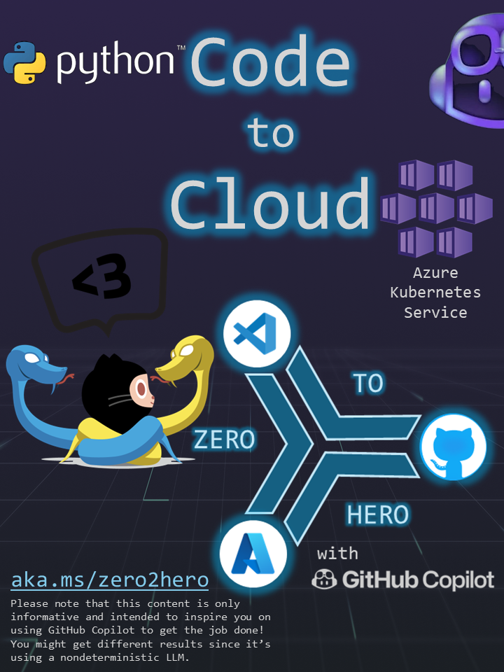
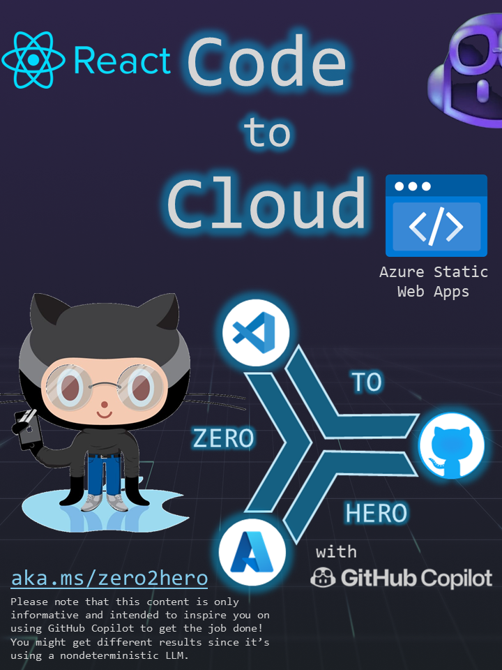
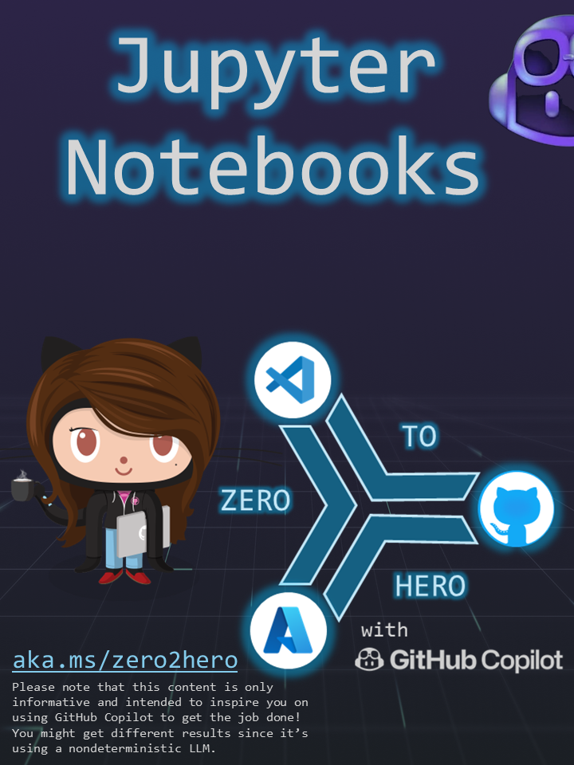
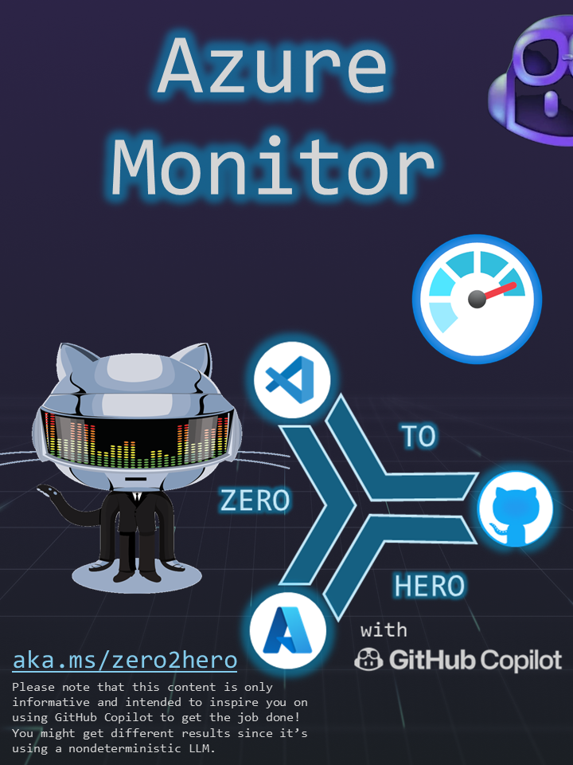
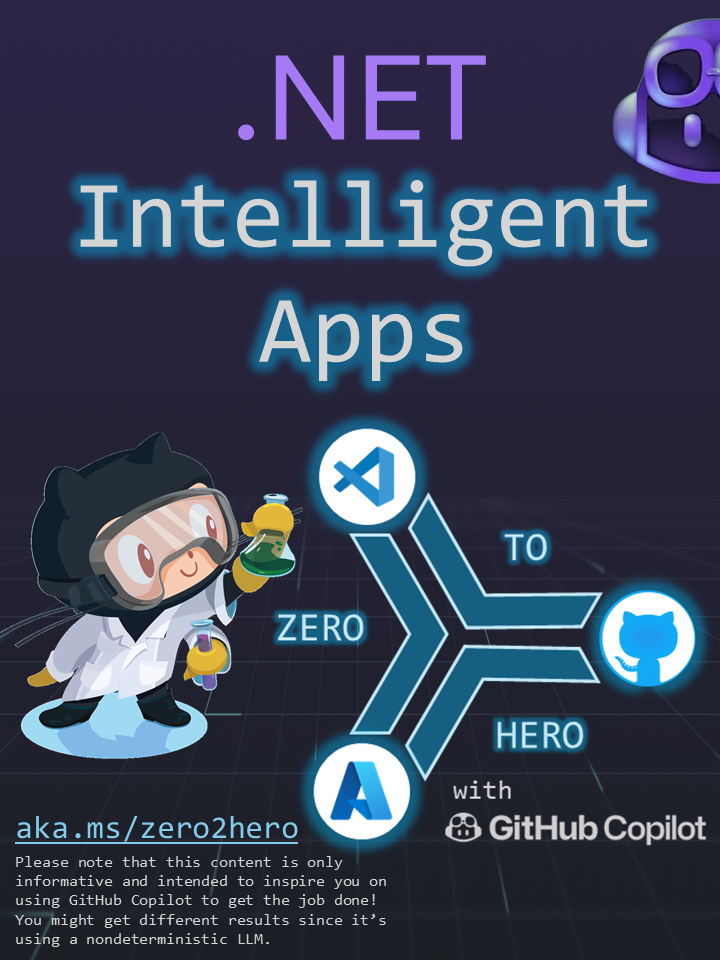

# Zero 2 Hero

This repo contains a set of sample journeys to explore and demonstrate what we can do with GitHub Copilot, the new Chat functionality and the power of the triad: #GitHub + #VSCode + #Azure 🚀

The goal here is to enable everyone to start from a blank environment and jump start on building Apps and deploying it to the Cloud (we use Azure here but the concepts are universal). We will leverage GitHub Copilot for much more than just programming code. GitHub Copilot will be our AI assistant to help us with the installation of the development frameworks, create the App code, build container images, create Azure resources, deploy code, create CI/CD workflows, build infrastructure as code, and much more. Limitless possibilities at your fingertips (we can even use our [voice](https://githubnext.com/projects/copilot-voice/)).

Starting from zero taking no assumptions has real advantagens. You could be an experience programmer or just getting started and I'm sure you will leverage the following journeys:

|  ✅ |  ✅ |  💤 |  💤 |  💤 | 
| --------------------------------------- | --------------------------------------- | --------------------------------------- | --------------------------------------- | --------------------------------------- | 
|  💤 |  💤 |  💤 |  💤 |  💤 |
|  💤 |  💤 |  💤 |  💤 |  💤 |
|  💤 |  💤 |  💤 |  💤 |  💤 |

### Quick start

To get started open the [environment setup journey](journeys/setup.PDF) and then pick any of the above journeys.

