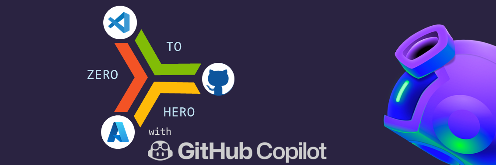
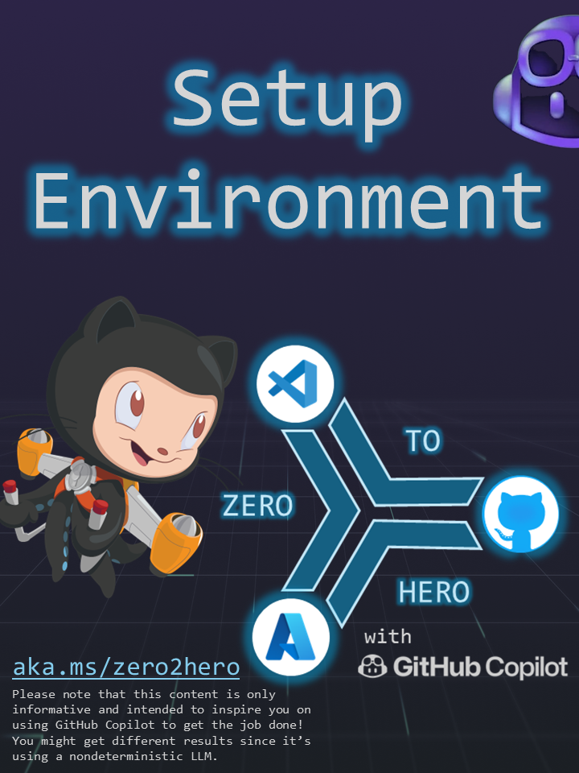

# Zero 2 Hero with GitHub Copilot

This repo contains a set of sample journeys and challenges to demonstrate and explore what we can do with GitHub Copilot, the Chat functionality and the power of the triad: #GitHub + #VisualStudio + #Azure 🚀

👉🏼 The goal here is to enable everyone to start from a blank environment and jump start on building Apps and deploying it to the Cloud (we use Azure here but the concepts are universal).

✨ We will leverage GitHub Copilot for much more than just programming code. GitHub Copilot will be our AI assistant to help us with the installation of the development frameworks, create the App code, build container images, create Azure resources, deploy code, create CI/CD workflows, build infrastructure as code, and much more.

🤯 Limitless possibilities at your fingertips, and you can even use your [voice](https://githubnext.com/projects/copilot-voice/)!

## Journeys

Starting from scratch, without making any assumptions, packs quite a punch of advantages. Whether you're a seasoned programmer or just hitting the launchpad, I'm confident you'll reap plenty of benefits from the journeys ahead.

|   |   |   |   | 
| --------------------------------------- | --------------------------------------- | --------------------------------------- | --------------------------------------- |

## Challenges

Ready to push your limits, crack your brains, and channel your inner geek? Are you all set to dare your daring and jump right into a frenzy of codes, caffeine, and creativity? Well, hold onto your keyboards, folks, because it's hackathon time! This is not just a typical day at the computer—it’s a pulse-racing, adrenaline-pumping journey into the world of GitHub Copilot! So, get ready to embark on the following challenges, and don't forget to bring your energy drinks and passion to out-code your competition!

|  |  | 
| -------- | -------- | 
|    | [Chuck Norries Jokes](challenges/chucknorris/)   | 
|    | [Sarcastic Bot](challenges/sarcasticbot/)   | 
|    | [Mini Games](challenges/minigames/)   | 

### Quick start

To get started just click in one of the above journeys or challenges and follow the instructions.

> [!NOTE]
> GitHub Copilot has a non-deterministic behaviour so the reponses that you will get might be different from the ones that we got when building this.

### Resources

- [Tips & Tricks](TIPS.md)
- [About GitHub Copilot Chat](https://docs.github.com/en/copilot/github-copilot-chat/about-github-copilot-chat)
- [How to use GitHub Copilot: Prompts, tips, and use cases](https://github.blog/2023-06-20-how-to-write-better-prompts-for-github-copilot/)

### 🌐 WW GBB initiative

### Disclaimer
> [!IMPORTANT]
> This software is provided for demonstration purposes only. It is not intended to be relied upon for any purpose. The creators of this software make no representations or warranties of any kind, express or implied, about the completeness, accuracy, reliability, suitability or availability with respect to the software or the information, products, services, or related graphics contained in the software for any purpose. Any reliance you place on such information is therefore strictly at your own risk.