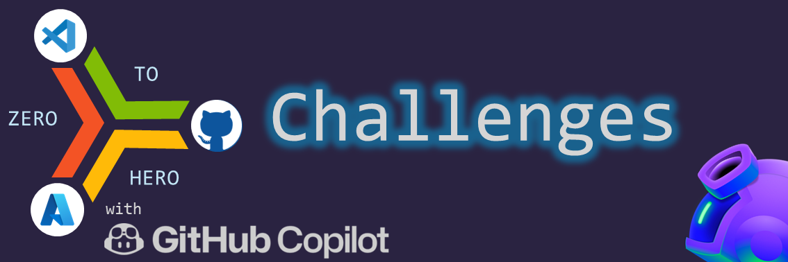

# Are you up for the ZERO 2 HERO challenges?

## 1. Setup your environment

Follow this [guide](../journeys/setup/) to configure your environment and login to GitHub and Azure (optional).

## 2. Pick a challenge

Ready to push your limits, crack your brains, and channel your inner geek? Are you all set to dare your daring and jump right into a frenzy of codes, caffeine, and creativity? Well, hold onto your keyboards, folks, because it's hackathon time! This is not just a typical day at the computer—it’s a pulse-racing, adrenaline-pumping journey into the world of GitHub Copilot! So, get ready to embark on the following challenges, and don't forget to bring your energy drinks and passion to out-code your competition!

|  |  | 
| -------- | -------- | 
|    | [Chuck Norries Jokes](chucknorris/)   | 
|    | [Sarcastic Bot](sarcasticbot/)   | 
|    | [Mini Games](minigames/)   | 
