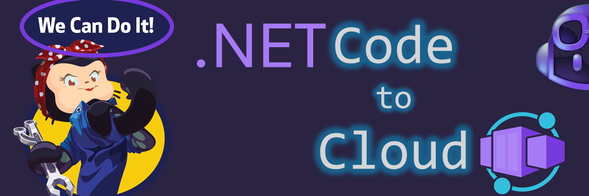

# ZERO 2 HERO - .NET code to Azure Container Apps

## Contents
- [Learning objectives](#learning-objectives)
- [Success criteria](#success-criteria)
- [1. Configure your environment](#1-configure-your-environment)
- [2. Login to GitHub and Azure](#2-login-to-github-and-azure)
- [3. Create the App](#3-create-the-app)
- [4. Add the User entity](#4-add-the-user-entity)
- [5. Add the new Service](#5-add-the-new-service)
- [6. Test it locally](#6-test-it-locally)
- [7. Add documentation](#7-add-documentation)
- [8. Deploy to Azure](#8-deploy-to-azure)
- [Conclusion](#conclusion)

## Learning objectives

👉🏼 Create a new .NET App from scratch.  
👉🏼 Code and test.  
👉🏼 Add documentation.  
👉🏼 Deploy to Azure Container Apps.  

## Success criteria

🎯 Show your **HERO** App running on Azure Container Apps.

## 1. Configure your environment

### 1.1 Option 1️⃣: Local environment

- Install or update to the latest [Visual Studio Code](https://code.visualstudio.com/).
- Install the [GitHub Copilot extension](https://code.visualstudio.com/docs/copilot/setup#_step-2-install-the-github-copilot-extension).
- Install the [GitHub Copilot Chat extension](https://marketplace.visualstudio.com/items?itemName=GitHub.copilot-chat).
- Install or update to the latest [Azure CLI](https://learn.microsoft.com/en-us/cli/azure/install-azure-cli).
- Install or update to the latest [.NET 8 SDK](https://dotnet.microsoft.com/en-us/download).

### 1.2 Option 2️⃣: GitHub Codespace
Just click on the following button to create a new GitHub Codespace:

The Codespace is already configured with the .NET SDK, Azure CLI and the VS Code extensions.

> [!NOTE]
>
> NOTE: You can use 60 hours of GitHub Codespaces [for free](https://github.com/features/codespaces#pricing) each month.

## 2. Login to GitHub and Azure

- [Sign in to GitHub](https://code.visualstudio.com/docs/copilot/setup#_step-3-sign-in-to-github).
- Open a terminal and [Sign in to Azure with Azure CLI](https://learn.microsoft.com/en-us/cli/azure/authenticate-azure-cli-interactively).

## 3. Create the App

💡 GitHub Copilot tip

> 
> 
> `steps to create a .NET blazor server app called HeroBlazorApp in the terminal and include pre-requirements`

   

🟦 Run the `dotnet new` command generated by GitHub Copilot.  
🟦 Install any suggested VS Code extension.  

## 4. Add the User entity

🟦 Create and open a new file named `User.cs` under the folder `Data`.  

💡 GitHub Copilot tip

> 
> 
> `create a User class in the HeroBlazorApp.Data namespace with id, name, username, email, phone and website properties and json mapping`

   

## 5. Change the razor page to add the new Service

🟦 Open the `Program.cs` file.  
🟦 Place the cursor before the `builder.Build` instruction.  

💡 GitHub Copilot tip

> 
> 
> `add builder for user service singleton and http client`

   

🟦 Add the `AddSingleton` and `AddHttpClient` generated code.  
🟦 Open the `Pages/FetchData.razor` file and select all the content.  

💡 GitHub Copilot tip

> 
> 
> `change this razor page with the router /fetchdata that display user information from the user service`

   

🟦 Accept the generated content.  

## 6. Test it locally

💡 GitHub Copilot tip

> 
> 
> `run my app`

   

🟦 Save all the files.  
🟦 Run `dotnet run` on the terminal.  
🟦 Open the browser and test the App.  

## 7. Add documentation

💡 GitHub Copilot tip

> 
> 
> `create a readme file in markdown format for this project`

   

🟦 Click on the `...` and choose `insert into New file`.  
🟦 Save the file as `READNE.md`.  

## 8. Deploy to Azure

💡 GitHub Copilot tip

> 
> 
> `use the az containerapp up command to deploy my app named heroblazorapp with external ingress on an environment named heroenv, a resource group named zero2hero-blazor located in west europe with the source parameter as "."`

   

🟦 Click on the `...` and choose `insert into Terminal`.  
🟦 Run the `az` command and wait until it finishes.  
🟦 Open the provided URL and test your App.  
🟦 Open the Azure Portal and check the resources that were created with the `az containerapp up` command.  
🟦 Open the Log Analytics workspace and browse to the `ContainerAppConsoleLogs_CL` table to see the App logs.  

## Conclusion

### ✨ Let's review GitHub Copilot

- Identified requirements and generated the command to create the App?  
- Generated entire new C# classes to extend the App and assisted to improve the code?  
- Generated documentation in markdown format based on the project context?  
- Generated the all-in-one command to deploy the App in Azure Container Apps?  

### 🗑️ Clean up Azure resources

When you're finished with the lab, you should remove all your deployed resources from Azure to avoid extra charges and keep your Azure subscription uncluttered.