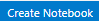

# ZERO 2 HERO - Notebooks

## Contents
- [Learning objectives](#learning-objectives)
- [Success criteria](#success-criteria)
- [1. Setup your environment](#1-setup-your-environment)
- [2. Create the App](#2-create-the-app)
- [3. Add the User entity](#3-add-the-user-entity)
- [4. Add the new Service](#4-add-the-new-service)
- [5. Test it locally](#5-test-it-locally)
- [6. Add documentation](#6-add-documentation)
- [7. Deploy to Azure](#7-deploy-to-azure)
- [Conclusion](#conclusion)

## Learning objectives

👉🏼 Create a new Jupyter Notebook from scratch.  
👉🏼 Code and test.  
👉🏼 Add documentation.  
 

## Success criteria

🎯 Show your **HERO** App running on Azure Container Apps.

## 1. Setup your environment

Follow this [guide](../setup/) to configure your environment and login to GitHub and Azure.

## 2. Create the Notebook

We want to ask GitHub Copilot Chat about the steps we need to do to create a Jupyter Notebook to run a sentiment analysis based on random feedback, by using natural language. Ensure that the prerequirements are included.

💡 GitHub Copilot tip

> 
> 
> `@workspace /newNotebook create a new notebook for sentiment analysis: add as sample 5 feedback`

   

🟦 Run the `@workspace /newNotebook`.   
🟦 Install any suggested VS Code extension.  
🟦 Hit   button.

The /newNotebook feature under @workspace scaffold a new Jupyter notebook by using natural language. This will generate a new notebook that is preconfigured based on a description.

## 3. Add a Visualization chart to the Notebook

🟦 Open the Notebook created on the previously step.  

Now we want to add a visualization chart to our notebook to display the sentiment analysis results. 

💡 GitHub Copilot tip

> 
> `@workspace plot the sentiment of the previous sentiment analysis into a chart`

   

🟦 Add a new code cell into notebook.
🟦 On the new code cell, copy the code suggested.

## 4. Add a new visualization chart type and transform the value labels

🟦 Place the cursor after the last cell of the notebook. 

Now we want to change the visualization chart type to a pie chart and add if the sentiment is positive, negative or neutral based on the feedback analysis values.

💡 GitHub Copilot tip

> 
> 
> `add as a visualization a pie chart with the sentiment of the feedback. If the sentiment value is greater than 0.2, the sentiment is positive. If the sentiment value is less than 0.2, the sentiment is negative. Otherwise, the sentiment is neutral`

   

🟦 Add a new code cell into notebook and copy the generated code into that cell.  
🟦 Run the cell by hitting the run command.  

With this step we changed the visualization output type, and also we transformed the sentiment values label to display the sentiment as positive, negative or neutral.

## 5. Run the notebook

Finally we want to test our notebook. Ask GitHub Copilot Chat how to run the notebook.

🟦 Into the notebook.ipynb file.  
🟦 Place the cursor on the *Run All* button.  

With this step we want to run the notebook and check the sentiment analysis based on the random feedback that we have added. Feel free to use GitHub Copilot Chat to help you with the steps to run the notebook and check the results.

💡 GitHub Copilot tip

> 
> 
> `how to run the notebook`

   

🟦 Save all the files.  

## 6. Add documentation

No one likes writing documentation, but everyone needs documentation. Luckily GitHub Copilot can also help you with that. Ask GitHub Copilot Chat to support you writing a `README.md` for our project.

💡 GitHub Copilot tip

> 
> 
> `create a readme file in markdown format for this project`

   

🟦 Click on the `...` and choose `insert into New file`.  
🟦 Save the file as `README.md`.  

## 7. Deploy to Azure

"Everything is ready, running, and documented? Great! Now, let's deploy it to Azure Machine Learning. For this simple task, please keep in mind that while Copilot could offer some commands using **az cli** with aml extension, they may not always be accurate. The objective here is for Copilot to explain the necessary steps to run the notebook into Azure Machine Learning workspaces rather than provide the exact code to do it."

💡 GitHub Copilot tip

> 
> 
> `how can I run my jupyter notebook in azure machine learning?`

   

🟦 Login into Azure.  
🟦 Follow the steps provided.  
🟦 Test you notebook in Azure Machine Learning Workspace.  
 

## Conclusion

### ✨ Let's review GitHub Copilot

- Identified requirements and generated the command to create the Notebook?  
- Generated entire new notebook cells to extend the visualization of the results?  
- Generated documentation in markdown format based on the project context?  
- Generated the all-in-one command to deploy the Notebook in Azure Machine Learning?  

### 🗑️ Clean up Azure resources

When you're finished with the lab, you should remove all your deployed resources from Azure to avoid extra charges and keep your Azure subscription uncluttered.

#### 📈 You had any problems with this journey, an idea how to improve it or an idea for a new journey? We are looking forward for your feedback as an issue or pull request. ✨