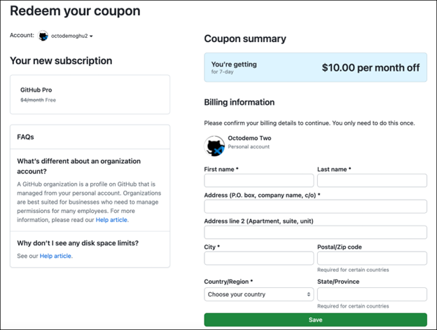
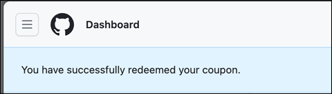
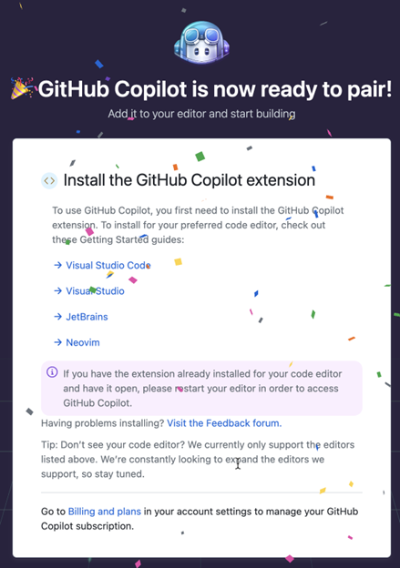

# ZERO 2 HERO - Redeem a GitHub Copilot Workshop Coupon

- Open a browser and log in to GitHub.
- Go to https://github.com/redeem/XXX-YYY where XXX-YYY is the coupon code for your workshop.

🔽

- Fill in the details and click save.

🔽

- Click the Redeem button.

🔽

- Confirm that the above message was received.

- Next, go to https://gh.io/copilot-free

🔽

- Click `Get access to GitHub Copilot`.
- Select preferemces and click `Save` to get started.

- 🥳
- Congratulations you are now ready to use GitHub Copilot!
